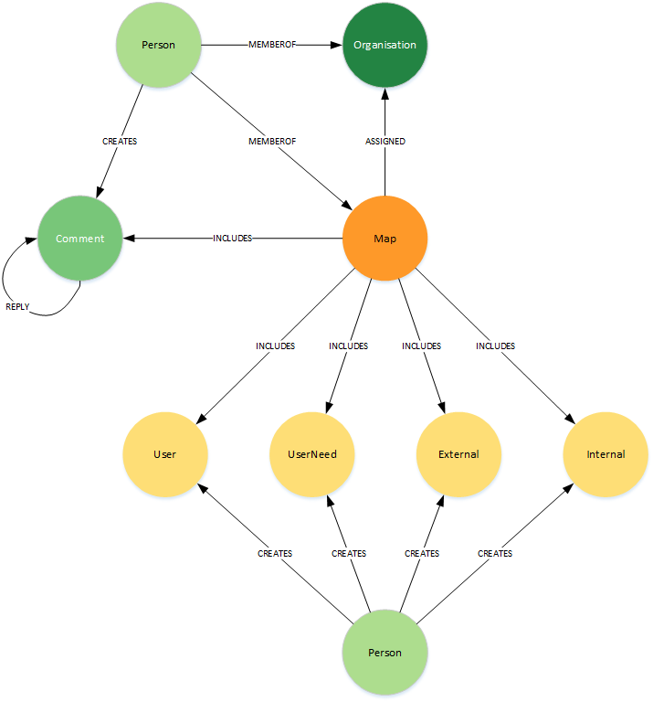
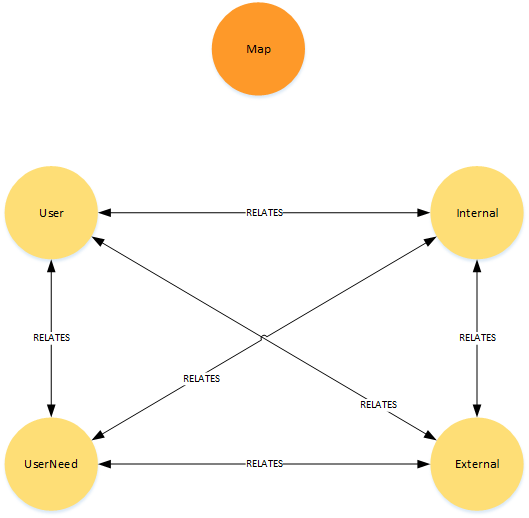
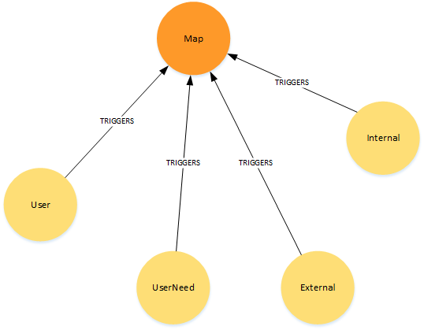
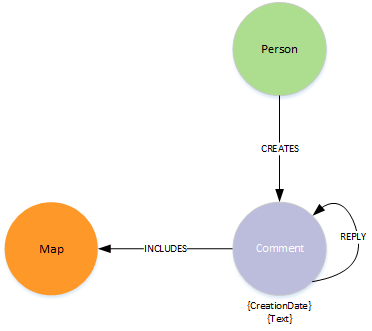

# Graph Data Model for Wardley Mapping

- Modelling drawn using [yED]()https://www.yworks.com/products/yed)
- [Source file](MapsSchema.graphml)

### Top level view
 

### Internal Map relationships
 

### Submap relationships
 

### Map Comments
 

---

### **Node Definitions**

#### Node Label: Person

|Property|Description|type|limits
|----|----|----|----|
|id|system generated
|name |
|email|
|LastLoginDate
|Active|

#### Node Label: Organisation

|Property|Description|type|limits
|----|----|----|----|
|id|system generated
|name |
|description|
|CreationDate|

#### Node Label: Map

|Property|Description|type|limits
|----|----|----|----|
|id|system generated
|name |
|description|
|type|Defines the type of map (main or submap)|list|
|CreationDate|

#### Node Label: UserNeed

|Property|Description|type|limits
|----|----|----|----|
|id|system generated
|name |
|Owner|responsible Person|
|Inertia| | |None,Small, Considerate,Huge
|Limitation| | |None,Constraint,Barrier to entry
|Description|

#### Node Label: User

|Property|Description|type|limits
|----|----|----|----|
|id|system generated
|name |
|description|

#### Node Label: Internal

|Property|Description|type|limits
|----|----|----|----|
|id|system generated
|name |
|Owner|responsible Person|
|Inertia| | |None,Small, Considerate,Huge
|Limitation| | |None,Constraint,Barrier to entry
|Description|

#### Node Label: External

|Property|Description|type|limits
|----|----|----|----|
|id|system generated
|name |
|Owner|responsible Person|
|Inertia| | |None,Small, Considerate,Huge
|Limitation| | |None,Constraint,Barrier to entry
|Description|

#### Node Label: Comment

|Property|Description|type|limits
|----|----|----|----|
|id|system generated
|text |
|CreationDate|

---
### Relationships

|Source|Destination|Name|Properties|
|----|----|----|----|
|Person|Map|MEMBEROF|
|Person|Organisation|MEMBEROF
|Person|Comment|CREATES|CreationDate
|Comment|Comment|REPLY|CreationDate
|Map|Organisation|ASSIGNED|
|Map|User|INCLUDES|
|Map|UserNeed|INCLUDES|
|Map|External|INCLUDES|
|Map|Internal|INCLUDES|
|Person|User|CREATES|CreationDate
|Person|UserNeed|CREATES|CreationDate
|Person|External|CREATES|CreationDate
|Person|Internal|CREATES|CreationDate
|####|####|####|
|User|UserNeed|RELATES|
|User|External|RELATES|
|User|Internal|RELATES|
|UserNeed|UserNeed|RELATES|
|UserNeed|User|RELATES|
|UserNeed|External|RELATES|
|UserNeed|Internal|RELATES|
|External|User|RELATES|
|External|UserNeed|RELATES|
|External|Internal|RELATES|{label},{description},{type:None, Constraint, Flow}
|External|External|RELATES|{label},{description},{type:None, Constraint, Flow}
|Internal|User|RELATES|
|Internal|UserNeed|RELATES|
|Internal|External|RELATES|
|User|Map|TRIGGERS|
|UserNeed|Map|TRIGGERS|
|External|Map|TRIGGERS|
|Internal|Map|TRIGGERS|

