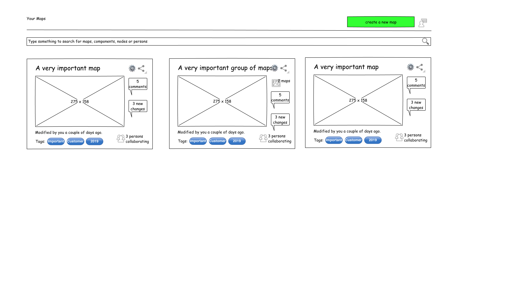

## :construction: WIP SECTION TO OUTLINE THE POTENTIAL TO DEVELOP A GRAPH BASED SOLUTION FOR WARDLEY MAPS :construction:

# Wardley Mapping module

- [Requirements from Chris](https://www.notion.so/The-new-tool-use-cases-a57986360b19470f8e9e8f3092f9d31f)

---

- [Data Model](MapsModel.md)
- [UI Mockups](UX/readme.md)

# Chris'es vision

# List of maps

As described in the https://github.com/atlasr2/GraphMaps/issues/6, maps, not organisations, will be in the spotlight. When the tool is launched, it will be possible to create a map with one click. Maps should get tags and comments in the beginning. It should be also possible to add a map to a shared context, or name or describe the context itself.

